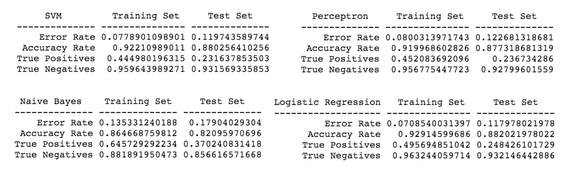

###Machine Learning Assignment 1: Classification

####Data 
Amazon Fine Food Reviews The Amazon Fine Food Reviews dataset consists of 455,000 food reviews Amazon users left up to October 2012. 

####Classification Taske
Train a model to best predict helpful, a boolean indicator that a review was deemed helpful by other shoppers. This was defined as:
(data.HelpfulnessDenominator > 3) & (data.helpScore >= 0.9)  

--------------
####Performance 
Model found in upper left corner. Organized by date. 

######3/01/2016
Features relating to punctuation and counts in the text and usernames

######3/29/2016
Changed from hashing vectorizor to TD-IDF

######4/21/2016

