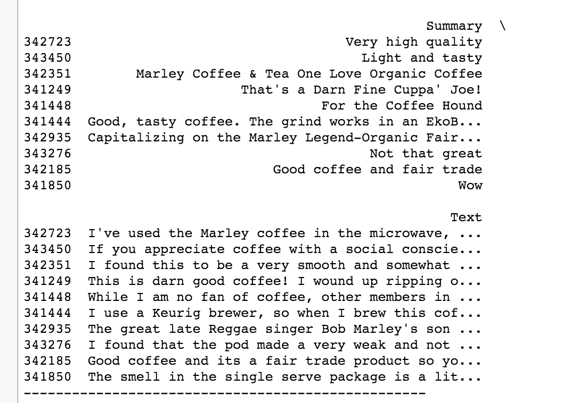

###Machine Learning Assignment 3: Clustering

####Data 
Amazon Fine Food Reviews The Amazon Fine Food Reviews dataset consists of 455,000 food reviews Amazon users left up to October 2012. 

--------------
####Performance 
Model found in upper left corner. Organized by date. 

######4/24/2016
Created 60 clusters. Obviously a lot, working on finding better metrics for measuring outcome. However, although the model may be overfitted, the clusters look prettty great. Some screenshots: 

From these summaries, it appears that it can differentiate between coffee and coffe K-Cups

